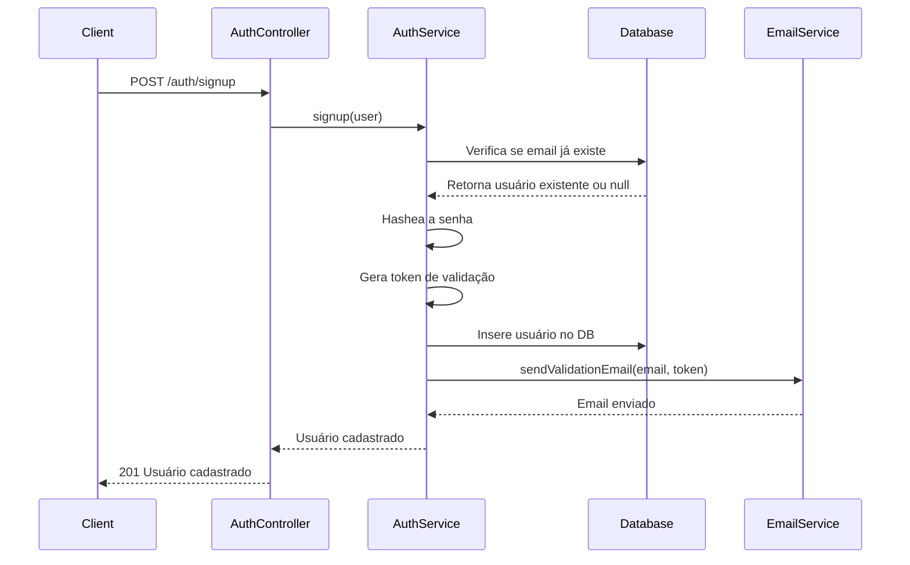
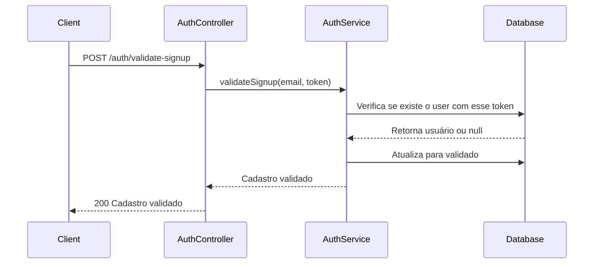
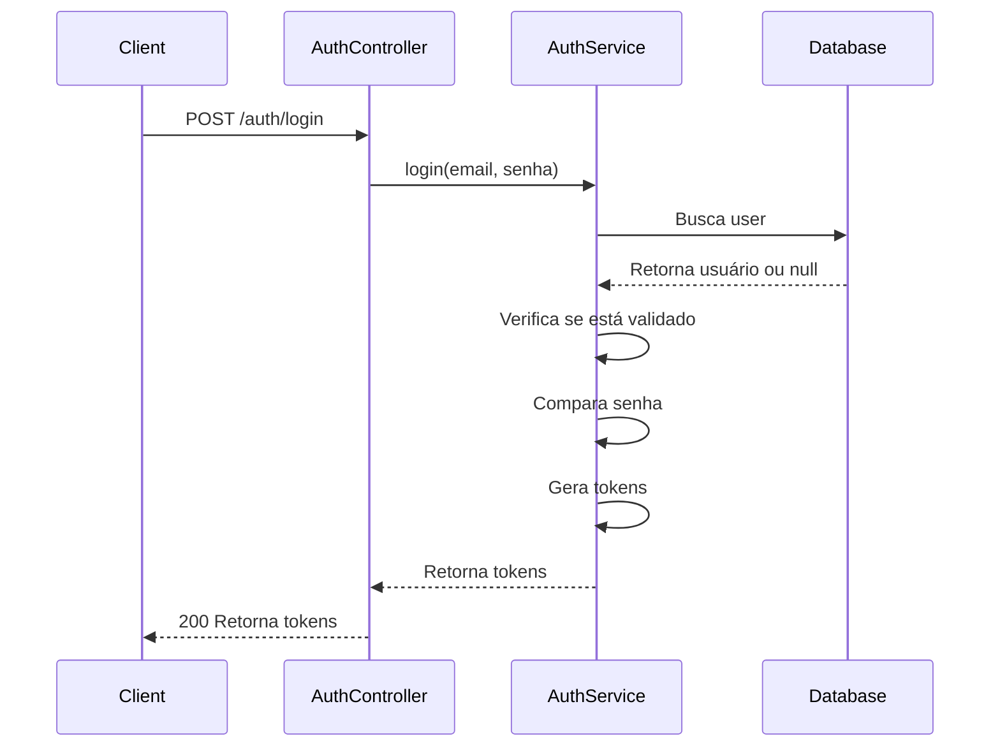
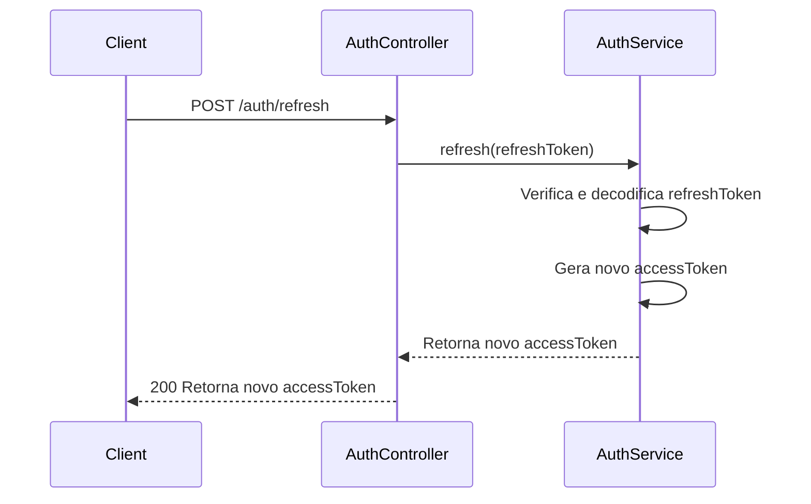
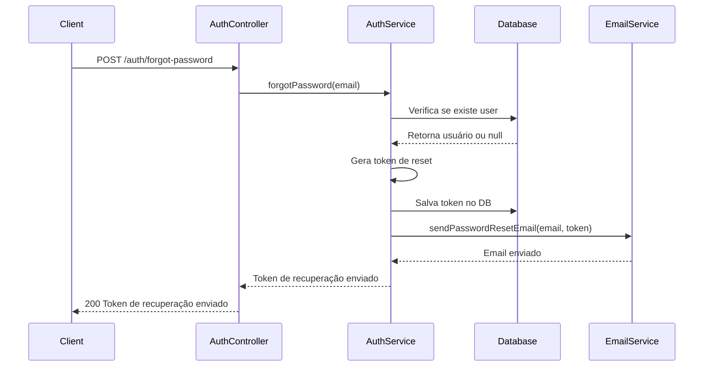

# Diagramas de Sequência dos Módulos AUTH da API

## Fluxo de Signup



## Fluxo de Validate Signup



## Fluxo de Login



## Fluxo de Refresh Token



## Fluxo de Forgot Password



## Fluxo de Reset Password

```mermaid
sequenceDiagram
    participant Client
    participant AuthController
    participant AuthService
    participant Database

    Client->>AuthController: POST /auth/reset-password
    AuthController->>AuthService: resetPassword(email, token, novaSenha)
    AuthService->>Database: Verifica se user existe e se token confere
    Database-->>AuthService: Retorna usuário ou null
    AuthService->>AuthService: Hashea nova senha
    AuthService->>Database: Atualiza senha no DB
    AuthService-->>AuthController: Senha redefinida
    AuthController-->>Client: 200 Senha redefinida
