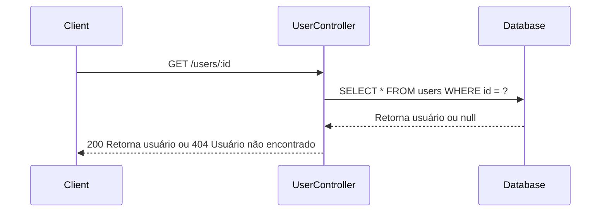
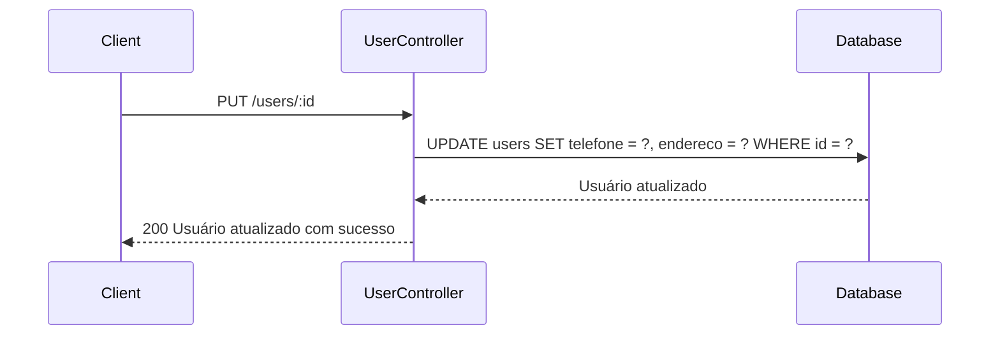
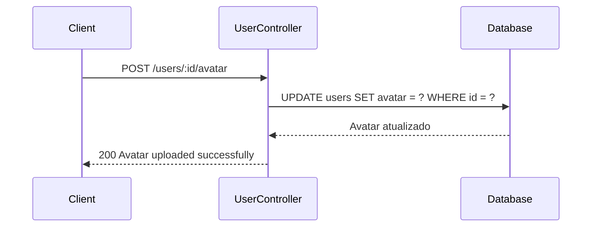
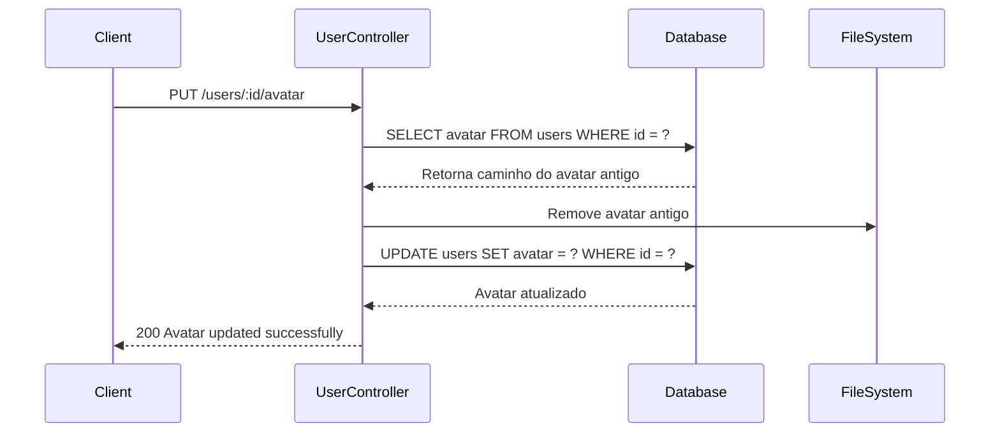
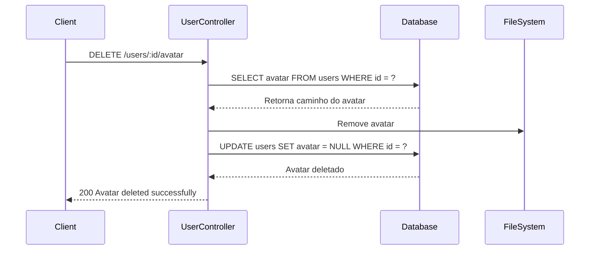

# Diagramas de Sequência dos Módulos USER da API

## Fluxo de Obter Usuário

## Fluxo de Atualizar Usuário

## Fluxo de Upload de Avatar

## Fluxo de Atualizar Avatar

## Fluxo de Deletar Avatar

